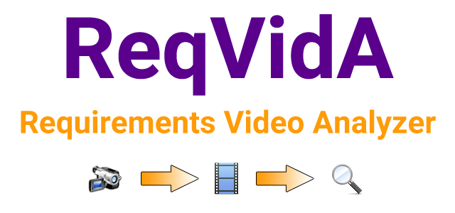

<!-- PROJECT SHIELDS -->
<!--
*** I'm using markdown "reference style" links for readability.
*** Reference links are enclosed in brackets [ ] instead of parentheses ( ).
*** See the bottom of this document for the declaration of the reference variables
*** for contributors-url, forks-url, etc. This is an optional, concise syntax you may use.
*** https://www.markdownguide.org/basic-syntax/#reference-style-links
-->
<!--[![Twitter][twitter-shield]][twitter-url]
[![LinkedIn][linkedin-shield]][linkedin-url]
-->

<!-- PROJECT LOGO -->
 

  

<h2 align="center">ReqVidA - Requirements Video Analyzer 
<i>"Video as a By-Product of Workshops"</i></h2>

  

   
    <!--<a href="https://github.com/okarras/ReqVidA">View Demo</a>
    ·-->
    <a href="https://github.com/okarras/ReqVidA/issues">Report Bug</a>
    ·
    <a href="https://github.com/okarras/ReqVidA/issues">Request Feature</a>
  

<!-- TABLE OF CONTENTS -->

  
Table of Contents

  <ol>
    <li><a href="#about-the-project">About the Project</a></li>
    <li><a href="#built-with">Built With</a></li>
    <li><a href="#getting-started">Getting Started</a></li>
    <li><a href="#usage">Usage</a></li>
    <li><a href="#publications">Publications</a></li>
    <li><a href="#contributing">Contributing</a></li>
    <li><a href="#license">License</a></li>
    <li><a href="#contact">Contact</a></li>
  </ol>

<!-- ABOUT THE PROJECT -->
## About the Project

<!--[![Product Name Screen Shot][product-screenshot]](https://github.com/okarras/ContiVQAExp)-->

    ReqVidA is a software tool to record a workshop on one or more videos and to analyze these videos afterwards. For this purpose, ReqVidA provides the two tailored graphical user interfaces Recorder and Analyzer. While the Recorder supports the recording of a workshop, the Analyzer is used to view of the recorded videos. Both views allow a scribe to create annotations, take notes, and write the textual minutes. Furthermore, a scribe can export all these artifacts at any time during or after a workshop.

(<a href="#top">back to top</a>)

<!-- BUILT WITH -->
## Built With

* [OpenJDK](https://openjdk.java.net/)
* [JavaFX](https://openjfx.io/)
* [ControlsFX](https://github.com/controlsfx/controlsfx)
* [JavaCV](https://github.com/bytedeco/javacv)
* [SQLite JDBC](https://github.com/xerial/sqlite-jdbc)
* [Apache Commons Lang](https://github.com/apache/commons-lang)

(<a href="#top">back to top</a>)

<!-- GETTING STARTED -->
## Getting Started
You need to install [OpenJDK](https://openjdk.java.net/) and [JavaFX](https://openjfx.io/) on your computer to run the project.

We use [Visual Studio Code](https://code.visualstudio.com/) for developement and can recommend the following [YouTube Tutorial](https://www.youtube.com/watch?v=H67COH9F718).

(<a href="#top">back to top</a>)

<!-- USAGE EXAMPLES -->
## Usage
The application of ReqVidA is shown in the following [document](example/README.md) with a screenshot, description, and an example.

(<a href="#top">back to top</a>)

<!-- PUBLICATIONS -->
## Publications

If you want to cite this project, we suggest to use either the citation provided above or the following reference:

>Oliver Karras, Stephan Kiesling, and Kurt Schneider: 
>[__Supporting Requirements Elicitation by Tool-Supported Video Analysis__](https://ieeexplore.ieee.org/abstract/document/7765520) 
>In: IEEE 24th International Requirements Engineering Conference (RE), IEEE, 2016.

The details of the implementation of ReqVidA are reported in the following reference:

>Oliver Karras 
>[__Tool-supported Analysis of Requirements Workshop Videos__](https://doi.org/10.15488/11951) 
>Leibniz Universität Hannover, 2015.

>Stephan Kiesling, Oliver Karras, and Kurt Schneider 
>[__ReqVidA – Requirements Video Analyzer__](https://fb-swt.gi.de/fileadmin/FB/SWT/Softwaretechnik-Trends/Verzeichnis/Band_36_Heft_3/paper_2.pdf) 
>In: Softwaretechnik-Trends, 36 (3), 2016.

The details of the "Video as a By-Product" approach, on which ReqVidA is based, are reported in the following reference:

>Oliver Karras 
>[__Supporting Requirements Communication for Shared Understanding by Applying Vision Videos in Requirements Engineering__](https://books.google.de/books?id=sEoyEAAAQBAJ&printsec=frontcover&hl=de#v=onepage&q&f=false) 
>Logos Verlag Berlin GmbH, 2021.

(<a href="#top">back to top</a>)

<!-- CONTRIBUTING -->
## Contributing

Contributions are what make the open source community such an amazing place to learn, inspire, and create. Any contributions you make are **greatly appreciated**.

If you have a suggestion that would make ReqVidA better, please fork the repo and create a pull request. You can also simply open an issue with the tag "enhancement".
Don't forget to give the project a star! Thanks again!

1. Fork the Project
2. Create your Feature Branch (`git checkout -b feature/AmazingFeature`)
3. Commit your Changes (`git commit -m 'Add some AmazingFeature'`)
4. Push to the Branch (`git push origin feature/AmazingFeature`)
5. Open a Pull Request

(<a href="#top">back to top</a>)

<!-- LICENSE -->
## License

Distributed under the MIT License. See `LICENSE` for more information.

(<a href="#top">back to top</a>)

<!-- CONTACT -->
## Contact

[Dr. rer. nat. Oliver Karras](https://www.oliver-karras.de) - [@OliverKarras](https://twitter.com/OliverKarras) - me@oliver-karras.de

(<a href="#top">back to top</a>)

