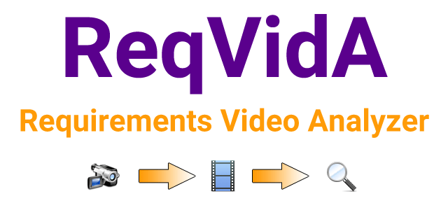

<!-- PROJECT LOGO -->
 

  

<h2 align="center">ReqVidA - Requirements Video Analyzer 
<i>"Video as a By-Product of Workshops"</i></h2>

<!-- TABLE OF CONTENTS -->

  
Table of Contents

  <ol>
    <li><a href="#about-this-document">About this Document</a></li>
    <li><a href="#about-reqvida---recorder">About ReqVidA - Recorder</a></li>
    <li><a href="#about-reqvida---analyzer">About ReqVidA - Analyzer</a></li>
    <li><a href="#example">Example</a></li>
  </ol>

<!-- ABOUT THIS DOCUMENT -->
## About this Document

    This document demonstrates the application of ReqVidA with a screenshot and descriptions. In addition, we provide an example that can be loaded into ReqVidA.

(<a href="#top">back to top</a>)

<!-- ABOUT REQVIDA - RECORDER -->
## About ReqVidA - Recorder

In the Recorder, a scribe can record one or more videos of a workshop. During the workshop, the scribe always sees a real-time display of the video image to monitor the recording, e.g., to ensure that all participants of the workshop are captured by the video camera (1). The Recorder supports the use of webcams and digital camcorders. A camcorder has to be connected with the mobile device, e.g., a notebook or Microsoft Surface, via a so-called "capture device" to transfer the video and audio data. In the case of multiple connected video and audio devices, the Recorder offers the opportunity to select the specific devices. This selection option is important to consider internal webcams of notebooks, front and back cameras of tablets, and the use of external microphones. Each created annotation with all its attributes is presented in an individual tab in the detail view (2). Although custom annotations can have arbitrary attributes, all annotations have a common set of attributes: a unique identification number, a name, a reference to the corresponding video, a timestamp in the video, a type, and a comment. The identification number, reference, and timestamp are automatically created by the software. All other attributes are optional and therefore do not need to be filled in at the time an annotation is created. Thus, the workflow of a scribe is not interrupted due to missing inputs. Besides the detail view of annotations, the Recorder provides a list of all created annotations sorted by their timestamps in the corresponding video (3). This list offers a simple overview of all annotations created so that a scribe can fast and easily access a specific annotation when needed. The Recorder also has an internal text editor to take notes and write the textual minutes (4). This editor helps to focus the scribe’s attention only on ReqVidA since no additional software is necessary for a scribe to perform his task.

(<a href="#top">back to top</a>)

<!-- ABOUT REQVIDA - Analyzer -->
## About ReqVidA - Analyzer

The Analyzer enables the analysis of a video by providing an integrated video player (1). Besides the basic functionalities, this video player has a snapshot function to extract images from the video to supplement the textual minutes. As the Recorder, the Analyzer allows a scribe to create annotations, take notes, and write the textual minutes. Therefore, the Analyzer also has the detail view of annotations (2), the sorted list of created annotations (3), and the internal text editor (4). These three components provide the same functionalities in the Recorder and Analyzer. In addition, the Analyzer has an interactive timeline that offers a visual overview of the annotations to facilitate a scribe’s navigation in the video (5). Based on three interaction options, i.e., single-clicking, double-clicking, as well as drag and drop, a scribe can interact with all points in the timeline which represent the created annotations. A scribe can open a specific annotation in the detail view by  single-clicking on the corresponding point. He can use double-clicking to open the annotation in the detail view and navigate directly to the corresponding part in the video. Last but not least, he can adjust the timestamp of the annotation by using drag and drop on the respective point. A special feature of the Analyzer is its flexibility in the analysis of any video, even if the video was not recorded with the Recorder. This flexibility and the customizable annotation system allow the applicability of ReqVidA in a variety of other scenarios beyond its original purpose of workshops.

(<a href="#top">back to top</a>)

<!-- EXAMPLE -->
## Example

The folder "3-Seiten-Presenter" also provides an example that can be loaded and used in ReqVidA. In this example, the participants of a workshop discuss their visions and requirements for a future software system. In agreement with the workshop participants, we verified that the video clip contains eleven requirements that should be included in the textual minutes of the workshop.

(<a href="#top">back to top</a>)
